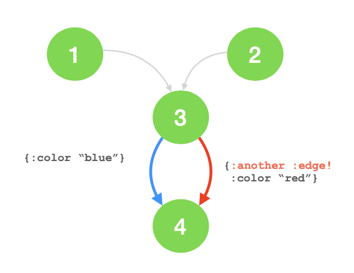

# extra-loom

Clojure/ Clojurescript extension to the Loom graph library with graphs that allow multiple edges between the same vetices.
The graphs here conform to all Loom's protocols so the richness of Loom's libraries 'just work'.

Clojurescript compatible.
A lot of the constructs in this library were inspired by Ubergraph, which is Clojure only and unfortunately would require considerable effort to convert to Clojurescript.

## Installation

deps.edn coords:

    io.github.judepayne/extra-loom {:git/tag "0.2.6" :git/sha "b420515"}

## Usage

    (require '[extra-loom.multigraph :refer :all])

At present, two graphs are implemented:
- `multigraph` (with undirected edges)
- `multidigraph` (with directed edges).
Both graphs can have multiple edges between any pairs of vertices in the graph

Weighted graphs are a `TODO`, and would require adapting some of the Loom algorithms.

### Creating a graph

Similar to Loom.

    ;; Initialize with any of: edges, nodes/vertices or adjacency lists
    (def g (multigraph [1 2] [1 2] [0 2]))                ;; edges
    (def dg (multidigraph [1 2] [1 2] 0))                 ;; with an additional node
    (def dg (multidigraph {1 [2 2] 0 [2]}                 ;; adjacency list
    
You can also create graphs with custom edge types that you have made. A custom edge type must implement the Loom `Edge` protocol and also the Extra-Loom `Identified` protocol.

Unlike Loom, edge attributes can be defined at creation:

    (def g (multidigraph [1 2] [2 3] [2 3] [1 2] [1 3 {:sugar true}] 4))

For graphs where both nodes and edges are specified as maps, use the `multigraph2` and `multidigraph2` creation functions. These functions take a collection of nodes, a `node-key` which is the key in the map that uniquely identifies each node and a collection of edges.

### Using a graph

extra-loom graphs implement the core Loom protocols:

   - Graph
   - Digraph
   - EditableGraph
   - AttrGraph

Call the methods in these protocols in exactly the same way you would for a Loom graph.

Since the graphs implement the loom protocols, Loom's algorithms just work:

    (require '[loom.graph :as l])
    (require '[loom.alg-generic :as ag])
    
    (def g (multidigraph [1 2] [2 3] [2 3] [1 2] [1 3 {:sugar true}] 4))
    
    
    (ag/pre-edge-traverse #(l/successors* g %) 1)
    ;; ==>
    ([1 2] [2 3] [1 3])

### Differences to Loom

#### Multiple edges

    (l/edges g)
    ;; ==>
    ({:id #uuid "efd71571-5861-4ef5-bcf0-d830e7010b88", :src 1, :dest 2}
     {:id #uuid "30f2885d-b878-4aa5-8012-d76090f00d14", :src 1, :dest 2}
     {:id #uuid "4dc7b2dd-a245-4190-a520-73c755aca47e", :src 1, :dest 3}
     {:id #uuid "99e4c402-5bc0-4e91-a653-58e0b1880132", :src 2, :dest 3}
     {:id #uuid "6b74efaa-01f6-45d3-8ed2-716990accfbb", :src 2, :dest 3})
     
extra-loom graph's need to have their own type of edge since in the example above their are multiple [1 2] and [2 3] edges. 

    (type (first (l/edges g))) ;; ==> extra_loom.graph.UniqueEdge
    
A `UniqueEdge` is identified by a UUID:

UniqueEdge is compatible with the Loom `Edge` protocol:

    (l/src (first (l/edges g))) ;; ==> 1
    
    (l/dest (first (l/edges g))) ;;==> 2
    
As well as implementing the Loom protocols, extra-loom defines a protocol called `MultipleEdge` to hold useful functions for working with multiedges, for example `edges-between`:

    (edges-between g 1 2)
    ;; ==>
    #{{:id #uuid "935a8f13-7d83-4206-a01a-0c614301f260", :src 1, :dest 2}
      {:id #uuid "73900eba-fd5e-4983-aac8-17b48bcbd184", :src 1, :dest 2}}

### Attrs
    
Attrs can be added by using Loom's `AttrGraph` protocol. For example:

    (add-attr g 4 :color "black")
    
will add {:color "black"} to the vertex 4.

attrs can be added to edges either by specifying a precise edge, e.g.

    (require '[loom.attr :as at]

    (def es (edges g))
    ;; ==>
    ({:id #uuid "935a8f13-7d83-4206-a01a-0c614301f260", :src 1, :dest 2}
     {:id #uuid "73900eba-fd5e-4983-aac8-17b48bcbd184", :src 1, :dest 2}
     {:id #uuid "a1ebfad4-c9b9-480d-9847-3c66f9a28167", :src 1, :dest 3})
     
    (at/add-attr g (first es) :color "white")
    
or when an edge is specified by its `src` and `dest` (and so is ambiguous in the context of a multidigraph)

    (at/add-attr g 1 2 :color "white")
    
The attr would be added onto both edges between vertices 1 and 2.

attrs can be fetched from vertices and edges using Loom's `attr` and `attrs` functions in the `loom.attr` namespace.

### Useful extras

In the `useful` namespace are several convenience functions for common graph operations and tests (that are not part of the loom algorithm set), for printing a representation of a graph and for covnerting a graph to dictim my visualization format that converts to d2.

### License

This software is distributed under the MIT license.
